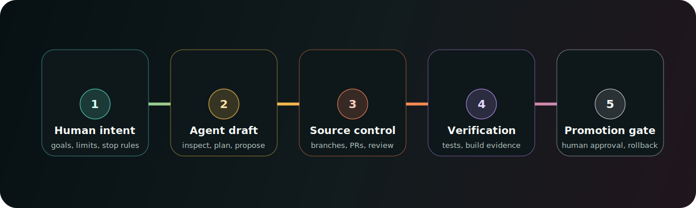

  

# gnu.in.labs

**gnu.in.labs builds local-first desktop systems, public infrastructure, and reviewable automation for people who want their computers to belong to them.**

This organization is not selling a finished operating-system fantasy. It is a public-facing lab for a sharper idea: modern machines already have local CPU, RAM, GPU, storage, sensors, and context. Automation should help the user inspect and control that machine, not quietly turn it into a client for someone else's platform.

## Current stance

GNU.IN work is experimental, serious, and still becoming public in stages.

- **Local-first by default.** Networked services can be useful, but the user's hardware and data should not become invisible raw material for remote systems.
- **Agent-assisted, not agent-ruled.** AI may inspect, summarize, draft, and stage work. It is not the final authority over live systems.
- **Radical in values, conservative in claims.** If something is not stable, supported, or verified, the public page should say so.
- **Learning in public is allowed.** The standard is not fake expertise. The standard is to turn exploration into readable code, tests, documentation, review, and release evidence.

## Public surfaces

| Surface | Status | Purpose |
| --- | --- | --- |
| [gnu6.live](https://gnu6.live) | Online | Public web/services entrypoint for GNU.IN experiments. |
| `.github` | Public | Organization profile, contribution defaults, security policy, and templates. |
| GNU.IN OS | Public-readiness in progress | Experimental local-first desktop runtime and shell environment. Public claims are being shaped before broader exposure. |

## Operating model

  

Agents are useful when they make work easier to inspect. They are dangerous when they hide risk behind fluent output.

The preferred GNU.IN pattern is:

1. Human intent defines the goal, constraints, and stopping criteria.
2. Agents inspect context, draft plans, and prepare reviewable changes.
3. Source control records the change.
4. Tests, builds, manifests, and reviews provide evidence.
5. Live mutation requires explicit human approval and rollback paths.

## What GNU.IN OS is trying to become

GNU.IN OS is a local-first desktop runtime direction, not a Linux replacement claim.

It explores:

- a Hyprland/Quickshell user session that can explain its own state;
- local AI as a user-owned capability rather than a hidden cloud dependency;
- shell and backend services that expose state through explicit contracts;
- build, staging, promotion, backup, and rollback discipline;
- an interface that a power user can own, and that a non-expert could eventually want to use.

Right now, it should be read as a research-product: coherent enough to deserve real engineering practice, but not mature enough to promise broad user support.

## What this is not

GNU.IN is not currently:

- a production-ready distribution;
- a safe autonomous system administrator;
- a cloud AI platform;
- a replacement for careful security review;
- a promise that every public idea is already implemented.

The goal is not to sound more mature than the work. The goal is to make the work easier to inspect, correct, and improve.

## For reviewers

Comments and corrections are welcome, especially when they point to concrete risk, missing evidence, unclear wording, accessibility problems, or better implementation paths.

Useful feedback looks like:

- "This claim needs a source or should be softened."
- "This workflow needs a rollback step."
- "This automation boundary is too broad."
- "This README is visually nice, but the text is not accessible enough."
- "This code path needs tests before it becomes a public promise."

## Contact

- Website: [gnu6.live](https://gnu6.live)
- General contact: [admin@gnu6.live](mailto:admin@gnu6.live)
- Security contact: [security@gnu6.live](mailto:security@gnu6.live)

---

&copy; gnuinlabs inc.
