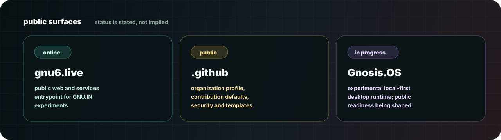

  

# gnu.in.labs

**gnu.in.labs inc. helps people and organizations understand, modify, host, and master their tools, data, and AI.**

We turn that responsibility into open engineering, inspectable documentation, local-first system work, and explicit human authority over consequential change. This profile is the concise index; [gnu.in.docs](https://gnu-in-labs.github.io/gnu.in-shell-docs/) is the detailed public claim-and-evidence authority.

## What we build

We work on tools and methods that make complex computing systems easier to inspect, adapt, operate, and reverse. Public descriptions separate what can be accessed now, how mature it is, and what evidence supports it.

The work is product-oriented without treating research, private implementation, or a bounded demonstration as a finished public release.

## Responsibility surfaces

| Surface | Responsibility | State |
| --- | --- | --- |
| gnu.in.labs | research, open engineering, documentation, methods, and experiments | organization surface |
| `gnosis.OS` | local Linux-session integration program | active development; no approved public release |
| `gnu6.live` | public information, documentation, references, status orientation, and authorized private entry | available |

## Current public surfaces

  

- [gnu6.live](https://gnu6.live) — public information, documentation routes, references, status orientation, and authorized-entry context.
- [gnu.in.docs](https://gnu-in-labs.github.io/gnu.in-shell-docs/) — bilingual public registry for claims, evidence, limitations, and direction.
- [This organization profile](https://github.com/gnu-in-labs/.github) — concise mission, responsibility, product map, and review routes.
- `gnosis.OS` — active private development; no approved public release.

Availability is not the same as implementation maturity. A public page may describe private development without exposing private source, topology, or operational details.

## Product and program map

| Name | Role and bounded state |
| --- | --- |
| `the lab` | Adopted architecture for research and development; not a public runtime. |
| `gnosis` | Planning and coordination direction under human authority; not an autonomous administrator. |
| `gnosis engine` | Central integration work in active private development; not human authority, system root, or a general agent. |
| `gnosis sentinel` | Watchdog and diagnostic context in active private development; not mutation authority. |
| `belt.in` | Welcome, update, and maintenance application in active private development; live mutation remains gated. |
| `mar.in` | Planned native-browser direction; Servo integration is incomplete. |
| `gnoclip` | Private Python control-and-research prototype with checkpoint A; the React Ink direction is planned, not shipped. |
| `gnomon` | Event, receipt, and evidence-ledger contracts exist; it does not decide, authorize, or execute, and persistence is not publicly verified. |

## How claims are published

Every public claim is classified on three independent axes:

1. **Access** — what a visitor can inspect or use now.
2. **Maturity** — implemented, verified locally, architecture adopted, in development, or planned.
3. **Evidence** — public, maintainer-verified private, or unavailable.

Public evidence is linked when it is safe and immutable. Private implementation facts are labelled as maintainer-verified and never gain a public link merely to make a stronger impression. Limitations travel with the claim.

## What this is not

gnu.in.labs is not claiming that:

- `gnosis.OS` is a kernel, distribution, compositor, or autonomous agent;
- private development is a public release;
- a portal simulation proves complete runtime integration;
- `gnu6.live` is an administrative console or public control plane;
- AI output can replace review, evidence, consent, rollback, or human authority;
- every direction in the product map is already implemented.

  

## Review, security, and contact

Corrections are welcome when they identify an unsupported claim, unclear limitation, accessibility problem, security risk, or stronger public evidence.

- Documentation: [gnu.in.docs](https://gnu-in-labs.github.io/gnu.in-shell-docs/)
- Website: [gnu6.live](https://gnu6.live)
- General contact: [admin@gnu6.live](mailto:admin@gnu6.live)
- Security reports: [security@gnu6.live](mailto:security@gnu6.live)

Please review code, permissions, service boundaries, and rollback paths before using experimental work on a system you rely on.

---

&copy; gnu.in.labs inc.
