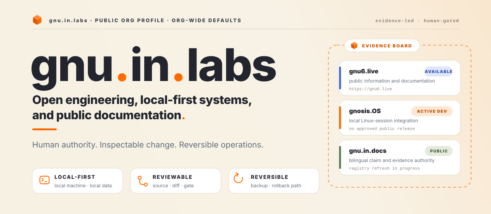
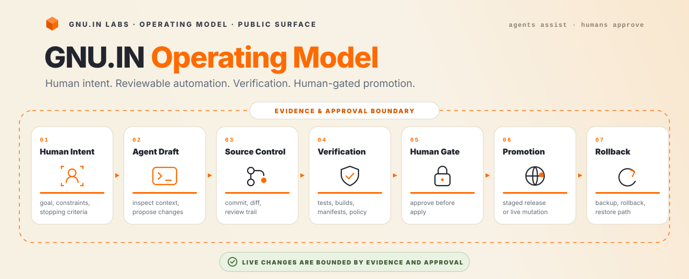

  

# gnu.in.labs

**gnu.in.labs builds local-first desktop systems, public infrastructure, and reviewable automation for people who want their computers to remain under their control.**

This is a public-facing lab for Gnosis.OS and related infrastructure experiments. The work is serious, but it is not being presented as a finished consumer operating system, a production distribution, or a safe autonomous administrator.

Modern computers already contain powerful local resources: CPU, RAM, GPU, storage, sensors, files, applications, and user context. GNU.IN explores how those resources can be made more inspectable, scriptable, reversible, and useful without quietly turning the user's machine into a passive client for someone else's platform.

## Current status

GNU.IN work is experimental and becoming public in stages.

The public goal is not to sound more mature than the work. The goal is to make the work easier to inspect, test, correct, and improve.

| Surface | Status | Purpose |
| --- | --- | --- |
| [gnu6.live](https://gnu6.live) | Online | Public web and services entrypoint for GNU.IN experiments. |
| `.github` | Public | Organization profile, contribution defaults, security policy, and issue templates. |
| Gnosis.OS | Public-readiness in progress | Experimental local-first desktop runtime and shell environment. Claims are being shaped before broader exposure. |

## Principles

GNU.IN work follows a few basic rules.

**Local-first by default.**  
Networked services can be useful, but local hardware and user data should not become invisible raw material for remote systems.

**Agent-assisted, not agent-ruled.**  
AI may inspect, summarize, draft, stage, and explain work. It is not the final authority over live systems.

**Visible automation.**  
Automation should leave evidence: source changes, logs, manifests, test results, rollback paths, and human-readable explanations.

**Conservative public claims.**  
If something is experimental, incomplete, unsupported, or unverified, the public page should say so.

**Learning in public is allowed.**  
The standard is not fake expertise. The standard is turning exploration into readable code, tests, documentation, review, and release evidence.

## Operating model

  

Agents are useful when they make work easier to inspect. They are dangerous when they hide risk behind fluent output.

The preferred GNU.IN pattern is:

1. Human intent defines the goal, constraints, and stopping criteria.
2. Agents inspect context, draft plans, and prepare reviewable changes.
3. Source control records the change.
4. Tests, builds, manifests, and reviews provide evidence.
5. Live mutation requires explicit human approval.
6. Promotion paths include rollback, backup, or recovery steps.

## Gnosis.OS direction

Gnosis.OS is a local-first desktop runtime direction. It is not a Linux replacement claim.

It explores:

- a Hyprland and Quickshell user session that can explain its own state;
- local AI as a user-owned capability rather than a hidden cloud dependency;
- shell and backend services that expose state through explicit contracts;
- build, staging, promotion, backup, and rollback discipline;
- reviewable automation for desktop configuration and system maintenance;
- an interface that a power user can own, and that a non-expert could eventually want to use.

Right now, Gnosis.OS should be read as a research-product: coherent enough to deserve real engineering practice, but not mature enough to promise broad user support.

## What this is not

GNU.IN is not currently:

- a production-ready distribution;
- a safe autonomous system administrator;
- a cloud AI platform;
- a replacement for careful security review;
- a promise that every public idea is already implemented;
- a claim that local-first means network-free;
- a claim that AI output is trustworthy without review.

## Review standards

Comments and corrections are welcome, especially when they identify concrete risk, missing evidence, unclear wording, accessibility problems, or better implementation paths.

Useful feedback looks like:

- "This claim needs evidence or should be softened."
- "This workflow needs a rollback step."
- "This automation boundary is too broad."
- "This README is visually nice, but the text is not accessible enough."
- "This code path needs tests before it becomes a public promise."
- "This agent action should be staged instead of applied directly."

## Security

GNU.IN treats automation, local AI, desktop control, and system mutation as security-sensitive areas.

Please do not assume that an experimental public repository is safe for production use. Review code, scripts, permissions, service boundaries, and rollback paths before running anything on a system you rely on.

Security reports can be sent to:

[security@gnu6.live](mailto:security@gnu6.live)

## Contact

- Website: [gnu6.live](https://gnu6.live)
- General contact: [admin@gnu6.live](mailto:admin@gnu6.live)
- Security contact: [security@gnu6.live](mailto:security@gnu6.live)

---

&copy; gnuinlabs inc.
